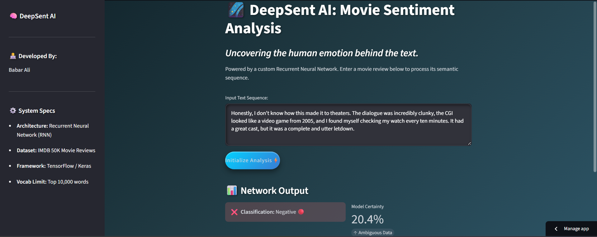

# 🌌 DeepSent: AI Movie Critic
*Uncovering the human emotion behind the text using Deep Learning.*

**[ Live Demo: Click Here to Try the App!](https://ai-movie-review-sentiment-analysis.streamlit.app/)**

---

##  Overview
**DeepSent (AI Movie Critic)** is an end-to-end web application powered by Deep Learning that analyzes text and determines its underlying emotional tone. Built with a custom **Recurrent Neural Network (RNN)** trained on the IMDB 50K movie review dataset, this app provides real-time sentiment classification (Positive/Negative) alongside a precise **Model Certainty Score**.

The frontend is designed with **Streamlit**

---

## Key Features
* **Deep Learning Engine:** Utilizes an RNN specifically tuned for sequential text analysis, capable of detecting complex sentiments like sarcasm and mixed reviews.
* **Real-Time Inference:** Employs Streamlit's `@st.cache_resource` to load the heavy Keras model into memory only once, resulting in zero-lag predictions.
* **True Certainty Metric:** Features a custom mathematical conversion that calculates exactly how confident the neural network is in its own prediction (0% to 100% scale).
* **Bulletproof Text Processing:** Includes a robust regex cleaning pipeline, a strict 10,000-word vocabulary cap, and safe `<UNK>` token handling to prevent Out-Of-Bounds indexing errors in production.
---

## Tech Stack
* **Language:** Python 
* **Deep Learning Framework:** TensorFlow / Keras (RNN)
* **Web Framework:** Streamlit
* **Data Processing:** NumPy, Regular Expressions (RegEx)

---

##  Under the Hood (How it Works)
1. **Input:** The user inputs a raw string of text.
2. **Preprocessing:** The text is stripped of punctuation, converted to lowercase, and split into individual words.
3. **Tokenization:** Words are mapped to their corresponding integer IDs based on the IMDB vocabulary dictionary. Unknown or rare words are safely assigned an `<UNK>` tag (index `2`).
4. **Padding:** The integer sequence is padded to exactly 500 tokens to match the model's expected input shape.
5. **Prediction:** The RNN processes the sequence and outputs a raw probability score, which is then translated into a user-friendly classification and confidence percentage.

---
